### Universidad de San Carlos de Guatemala
### Facultad de Ingeniería en Ciencias y Sistemas
### Lenguajes Formales y de Programación
### Sección "P" - Junio 2023

---
# Manual de Usuario - Proyecto Spark Stack

Pantalla de Bienvenida, se muestra durante 5 segundos

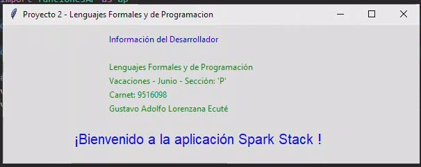

Pantalla Principal

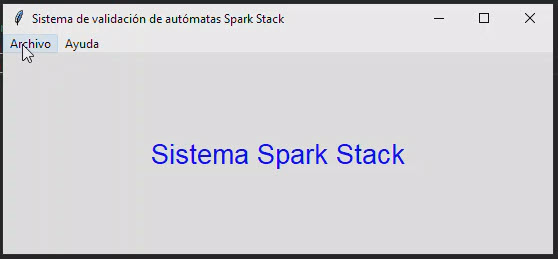

Para cargar un archivo con extension .glc

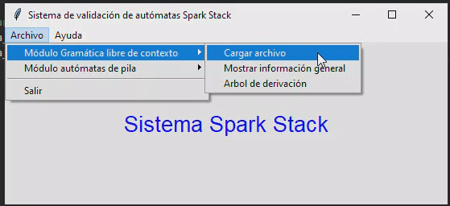

Seleecionar el archivo de entrada con la Gramatica Libre de Contexto

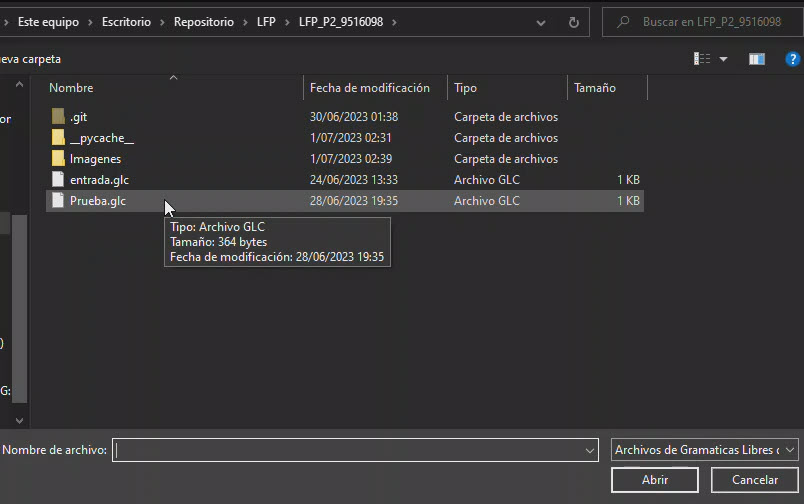

Si el sistema no tiene errores ni gramaticas repetidas muestra el siguiente mensaje

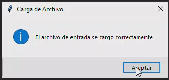

Si existe alguna gramatica repetida muestra el siguiente mensaje

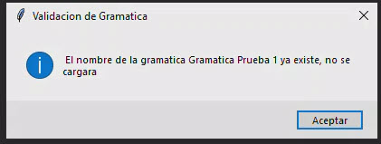

Para ver la informacion general de la gramatica se selecciona la siguente opcion

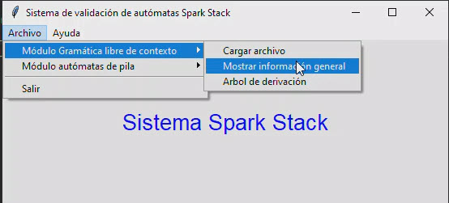

En la parte izquierda aparece el listado de gramaticas disponibles, se selecciona colocando el numero que la identifica y click en el boton Consultar.

En el area en blanco se muestra las transiciones de la gramatica.

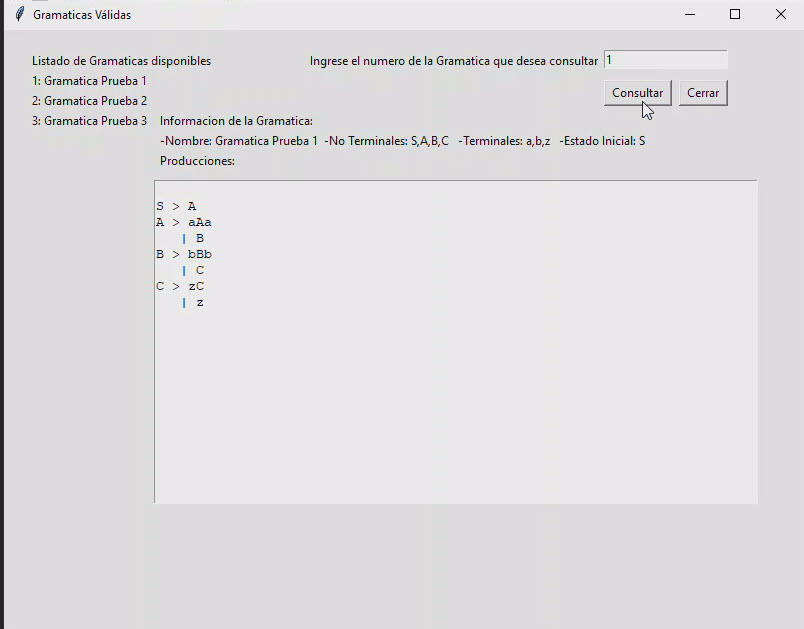

Para ver el arbol de derivacion se selecciona la siguiente opcion, esta opcion muestra el arbol de derivacion de la gramatica seleccionada anteriormente.

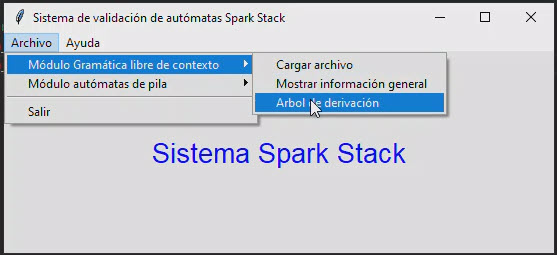

Se selecciona el numero de la gramatica que identifica la que se quiere consultar
ademas de mostrar la informacion general de la gramatica al presionar el boton Consultar y ver Arbol muestra el arbol de derivacion de la gramatica

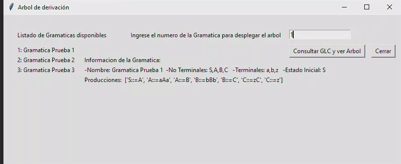

El arbol de derivacion se muestra de la siguiente manera.

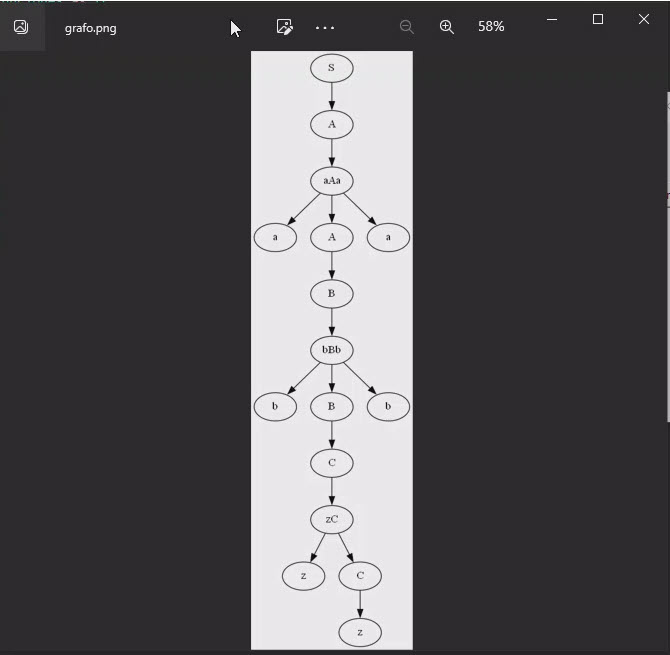

El menu de Automatas de pila tiene las siguientes opciones, la primera es para carga de archivos con extension AP

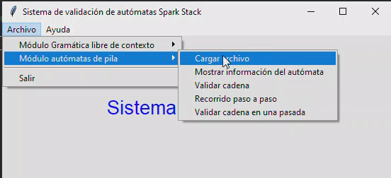

Se selecciona el archiovo de entrada que contiene los Automatas de pila

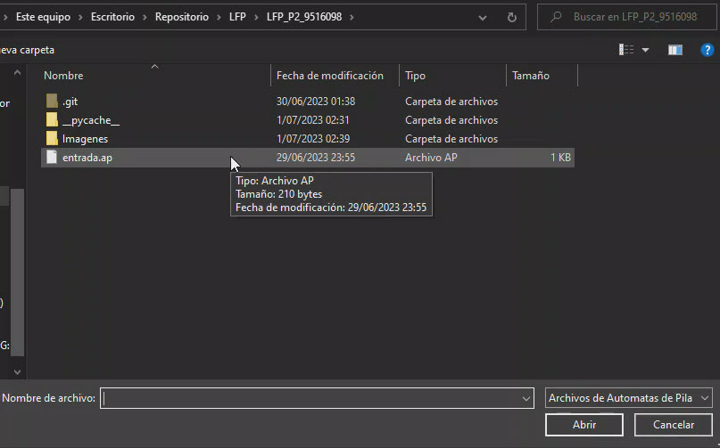

si el archivo no tiene errores muestra el siguiente mensaje

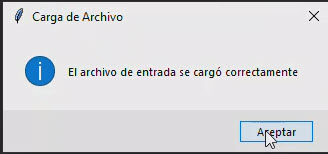

Si el archivo tiene automatas repetidos muestra el mensaje

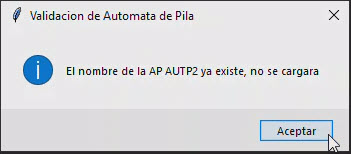

En esta opcion se muestra la informacion general del automata

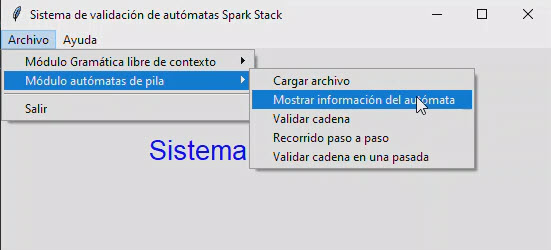

Se selecciona el numero del automata para desplegar la informacion

Despues de desplegar la informacion muestra un boton para generar un reporte en pdf
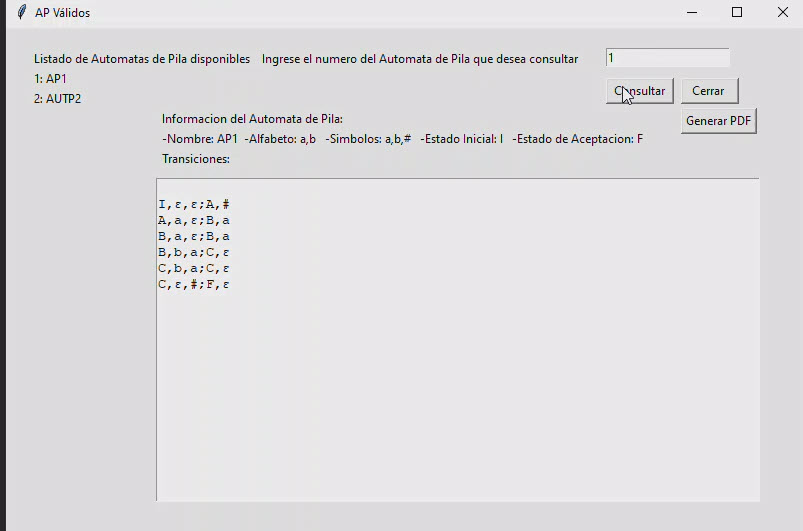

Al seleccionarlo muestra el siguiente mensaje

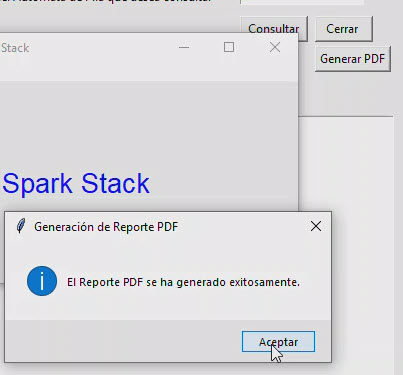

En la opcion validar Cadena se verifica si una cadena ingresada es aceptada o rechazada por el automata

Se selecciona el numero de automata para consultarlo
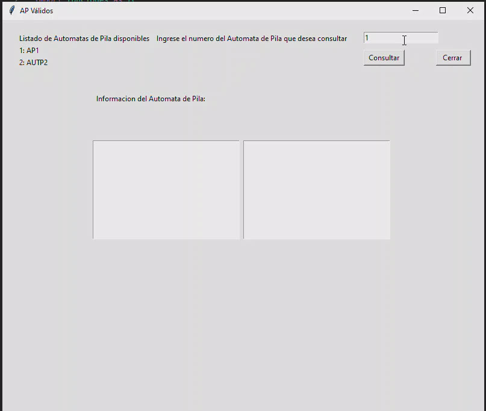

Al seleccionar el numero de automata, se activa la casilla para ingresar la cadena que se quiere validar 

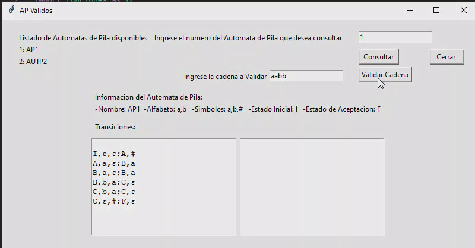

Despliega el mensaje si es aceptada o rechazada la cadena ingresada

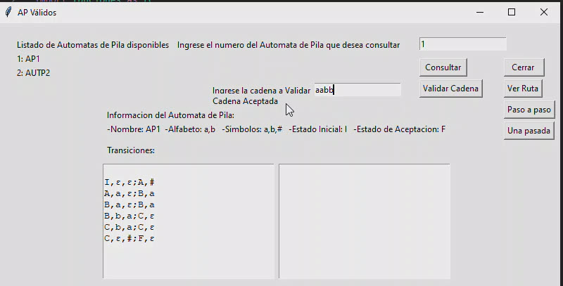

luego de ingresada una cadena y aceptada se puede verificar la ruta que siguio el automata para la validacion.

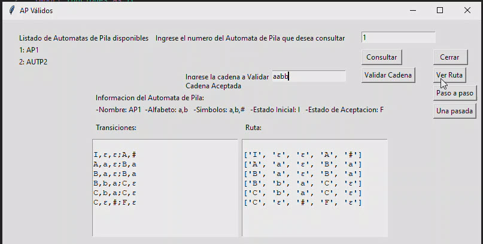

Se puede verificar la ruta paso a paso

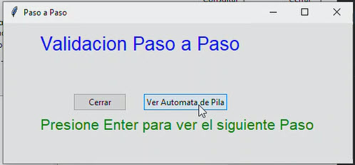

se puede verificar la ruta de una sola pasada 

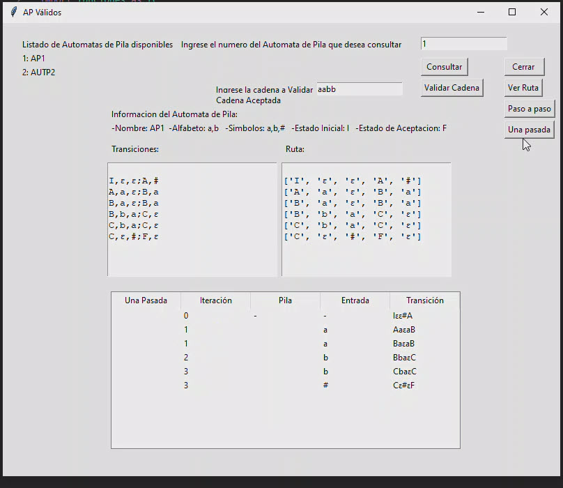

La opcion de ayuda muestra los manuales Tecnico y de Usuario
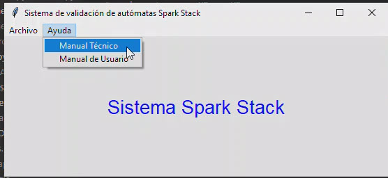

Al seleccionarla muestra el manual  tecnico en una ventana web

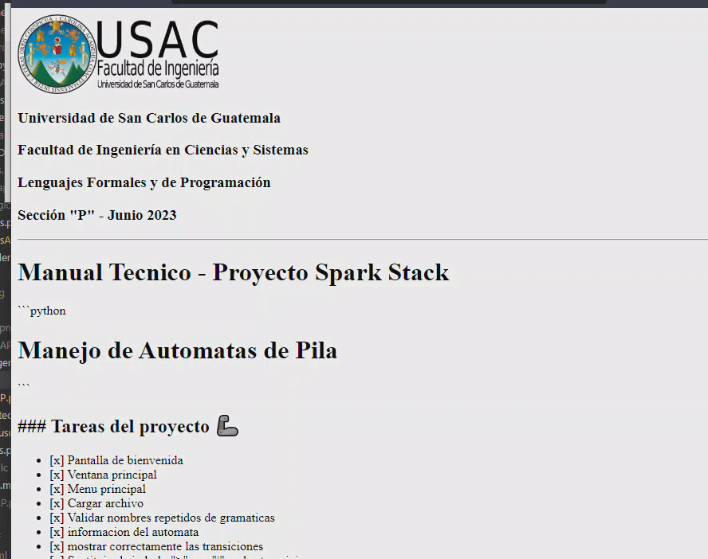

La opcion de ayuda muestra los manuales Tecnico y de Usuario

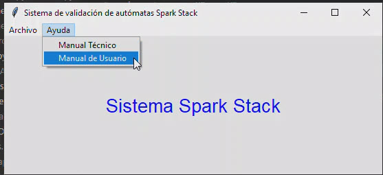

Al seleccionarla muestra el manual  tecnico en una ventana web

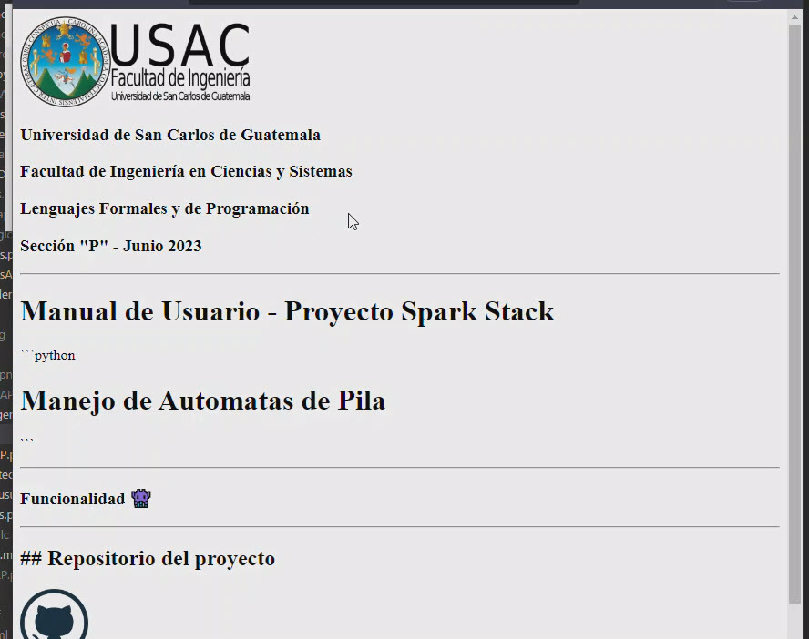

Al finalizar la aplicacion en la opcion salir del menu principal muestra una pantalla de despedida durante 5 segundos.

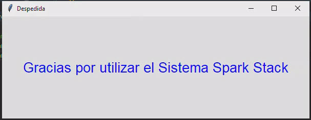

---

### Funcionalidad 👾 

---
## Repositorio del proyecto 
---

🐱
[Repositorio github.com](https://github.com/IngUsac/LFP_P2_9516098 "Repositorio del Proyecto 2 - LFP") 

